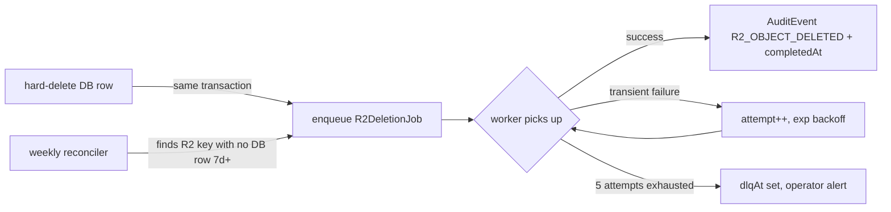

# Veracrew — Engineering & Architecture Spec

This is the canonical technical reference for Veracrew. It covers stack, the multi-tenant security model, the Prisma schema, storage, offline behavior, internationalization, payroll math, audit trail, and security. For product vision and user-facing feature descriptions, see [`docs/veracrew.md`](./veracrew.md). For build sequence and phase gates, see [`docs/implementation_checklist.md`](./implementation_checklist.md).

> **Status**: pre-implementation spec. Nothing in this document describes code that currently exists in the repo (the codebase is a landing page only). Everything here is authoritative intent; as each phase ships, the corresponding section should be updated with real file paths and deviations.

---

## 1. Stack

| Layer | Choice | Notes |
|---|---|---|
| Framework | Next.js 16 (App Router) | Server Components by default; `"use client"` only when required |
| Runtime | React 19 | React Compiler enabled via `babel-plugin-react-compiler` |
| Styling | TailwindCSS v4 | CSS-based config in `src/app/globals.css`; no `tailwind.config.*` |
| Language | TypeScript strict | No `any`; unknown + type guards for truly unknown shapes |
| ORM | Prisma | Versioned migrations from day one |
| Database | PostgreSQL | Neon or managed Postgres; RLS-capable (not SQLite / not Planetscale MySQL) |
| Auth | NextAuth / Auth.js | Email + Google OAuth; 2FA (TOTP) for OWNER/ADMIN |
| Validation | Zod | Every external boundary |
| Object storage | **Cloudflare R2** | S3-compatible; two buckets (`docs`, `images`); zero egress fees |
| Bot protection | **Cloudflare Turnstile** | Signup, invite-accept, public forms |
| Email | Resend | Invites, reminders, urgent notifications |
| SMB subscription billing | Stripe Billing | Org-level subscriptions; 14-day Growth-equivalent trial + one paid plan at MVP (§6.7) |
| Rate limiting | Upstash Redis | Auth, invites, clock-in, uploads |
| i18n | `next-intl` | EN + FR at launch; org default + per-user override |
| Offline / mobile | PWA (Workbox) | Service worker, IndexedDB queue, Background Sync, Web Push |
| Hosting | Vercel | Edge where appropriate; long tasks offloaded |
| Testing | Vitest + Playwright | Vitest for helpers/pay-math; Playwright for critical flows later |

### External integrations (explicitly deferred)

- Gusto / QuickBooks Payroll / ADP — payroll export lands in MVP; API integrations post-MVP
- ClamAV / virus scanning — see §17
- Stripe Connect — never planned; we do not process customer-facing payments
- Native mobile (React Native/Expo) — PWA-first; re-evaluate after MVP feedback

---

## 2. Canonical terminology

Two different concepts are frequently confused as "role". Always use the correct term in code and docs.

| Term | Meaning | Where it lives |
|---|---|---|
| **Organization** | The tenant. Everything scopes to one. | `Organization` table |
| **User** | A global identity. Can belong to multiple orgs. | `User` table |
| **Membership** | A user's presence in one org, with a platform role. | `Membership` table |
| **Platform role** | Access tier: `OWNER`, `ADMIN`, `MANAGER`, `WORKER`. | `Membership.role` |
| **JobRole** | Trade / pay tier: e.g. Foreman, Apprentice, Electrician. Drives pay rates. | `Membership.jobRoleId` → `JobRole` |
| **Shift** | Recurring work block at a location. | `Shift` + `ShiftAssignment` |
| **Job** | One-off project work. | `Job` + `JobAssignment` |
| **TimeEntry** | A clock-in/out record with nested `Break` rows. | `TimeEntry` |
| **Invoice** | A **record** of billing for a client. Veracrew never processes payment. | `Invoice` + `InvoiceLineItem` |
| **OrgSubscription** | Stripe-managed subscription the SMB pays Veracrew. | `StripeCustomer` + `OrgSubscription` |

Money is always stored as **integer cents** (`Int`). Multipliers are stored as **basis points** (`Int`, where `15000 = 1.5x`). `Float` is banned for any financial value.

---

## 3. Authentication & session

### Providers

- Email + password (NextAuth credentials provider with secure hashing — Argon2id preferred over bcrypt for new projects)
- Google OAuth
- Magic-link (optional; convenient for invite-accept flow)

### Session shape

```ts
// conceptual — actual NextAuth session callback shape
type VeracrewSession = {
  user: {
    id: string;             // global User.id
    email: string;
    name?: string;
    locale: "en" | "fr";
    twoFactorEnabled: boolean;
  };
  organizationId: string;    // active org (cookie-persisted, re-validated per request)
  role: "OWNER" | "ADMIN" | "MANAGER" | "WORKER";
  jobRoleId?: string;        // resolves pay rate
  membershipId: string;
};
```

**Critical invariant**: `organizationId` is resolved from the session and validated against `Membership` on every request. It is **never** taken from request bodies, route params, or headers from the client.

### 2FA (TOTP)

- **Required** for `OWNER` and `ADMIN` (enforced at login; enrollment on first sign-in after promotion)
- **Optional** for `MANAGER` and `WORKER`
- TOTP via any authenticator app (Authy, 1Password, Google Authenticator)
- Backup codes generated at enrollment (10 codes, single-use)
- Recovery procedure: documented support flow — identity verification + audit event on reset. No self-serve recovery if both device and backup codes are lost.

### Session rotation

Rotate session on: password change, 2FA enable/disable, role change, org-switch. Old session ID invalidated server-side.

---

## 4. Multi-tenant security model (three layers)

**The #1 risk in a B2B SaaS is cross-tenant data leakage.** We defend in depth with three layers. Any single layer failing should not produce a leak.

### Layer 1 — Session context (code)

Every server action and route handler starts with:

```ts
// src/lib/auth/context.ts
export async function requireOrgContext() {
  const session = await auth();
  if (!session) throw new UnauthorizedError();
  if (!session.organizationId) throw new NoActiveOrgError();

  // re-verify membership is still active (not revoked between requests)
  const membership = await prisma.membership.findUnique({
    where: { id: session.membershipId },
  });
  if (!membership || membership.status !== "ACTIVE") {
    throw new ForbiddenError("Membership no longer active");
  }
  if (membership.organizationId !== session.organizationId) {
    throw new ForbiddenError("Org mismatch");
  }

  return {
    userId: session.user.id,
    organizationId: session.organizationId,
    role: session.role,
    jobRoleId: session.jobRoleId,
    membershipId: session.membershipId,
  };
}
```

### Layer 2 — `scopedPrisma` wrapper (app-level enforcement)

The single most impactful pattern. A thin wrapper around Prisma that **auto-injects `organizationId`** on every query for tenant-scoped models:

```ts
// src/lib/db/scoped-prisma.ts
export function scopedPrisma(organizationId: string) {
  return prisma.$extends({
    query: {
      $allModels: {
        async $allOperations({ model, operation, args, query }) {
          if (TENANT_SCOPED_MODELS.has(model) && MUTATING_OR_READING_OPS.has(operation)) {
            args.where = { ...(args.where ?? {}), organizationId };
            if (operation === "create" || operation === "createMany") {
              args.data = injectOrgId(args.data, organizationId);
            }
          }
          return query(args);
        },
      },
    },
  });
}
```

Single-record fetches additionally verify the returned row's `organizationId`:

```ts
const job = await db.job.findUniqueOrThrow({ where: { id } });
if (job.organizationId !== ctx.organizationId) throw new ForbiddenError();
```

### Layer 3 — Postgres Row Level Security (belt & suspenders)

Enabled **Phase 0** on every tenant-scoped table. Even if an app-layer bug slipped through, the database refuses the row.

Migration pattern:

```sql
ALTER TABLE "Job" ENABLE ROW LEVEL SECURITY;

CREATE POLICY job_tenant_isolation ON "Job"
  USING ("organizationId" = current_setting('app.current_org_id', true)::text)
  WITH CHECK ("organizationId" = current_setting('app.current_org_id', true)::text);
```

Transaction wrapper that sets the context:

```ts
export async function withOrgRLS<T>(organizationId: string, fn: () => Promise<T>) {
  return prisma.$transaction(async (tx) => {
    await tx.$executeRawUnsafe(
      `SET LOCAL app.current_org_id = '${escapeSqlLiteral(organizationId)}'`
    );
    return fn();
  });
}
```

#### Operational notes

- Use `SET LOCAL` (transaction-scoped), not `SET` (connection-scoped) — critical with PgBouncer / Neon pooler.
- Every tenant-scoped query must run inside `withOrgRLS` or through `scopedPrisma` (which internally uses it).
- The `app.current_org_id` setting is escaped against SQL injection; the value comes only from `requireOrgContext()`.
- Superuser role used for migrations; a separate app role (with `BYPASSRLS = OFF`) used at runtime.

### What is NOT tenant-scoped

A small allowlist of models is global (no `organizationId`, no RLS): `User`, `Account`, `Session`, `VerificationToken`. Everything else is scoped.

---

## 5. RBAC matrix

Canonical source of truth. Every permission helper and UI gating decision must derive from this table. Kept small by modeling roles as a hierarchy (`OWNER > ADMIN > MANAGER > WORKER`).

| Action | OWNER | ADMIN | MANAGER | WORKER |
|---|:---:|:---:|:---:|:---:|
| Create organization | ✓ | — | — | — |
| Manage Stripe billing | ✓ | — | — | — |
| Delete / transfer organization | ✓ | — | — | — |
| Enable / disable 2FA enforcement | ✓ | ✓ | — | — |
| Configure pay rules (rates, OT thresholds, holidays) | ✓ | ✓ | — | — |
| Configure clock-in gating policy | ✓ | ✓ | — | — |
| Manage `DocumentTemplate` library | ✓ | ✓ | ✓ | — |
| Manage `JobRole` (trades + default rates) | ✓ | ✓ | — | — |
| Invite `ADMIN` or `MANAGER` | ✓ | ✓ | — | — |
| Invite `WORKER` | ✓ | ✓ | ✓ | — |
| Revoke pending invites | ✓ | ✓ | ✓ | — |
| Promote / demote `Membership.role` | ✓ | ✓ *except promoting to OWNER* | — | — |
| Manage locations | ✓ | ✓ | ✓ | — |
| Create / edit jobs + `JobRequiredDocument` | ✓ | ✓ | ✓ | — |
| Create recurring shifts | ✓ | ✓ | ✓ | — |
| Assign workers to shifts / jobs | ✓ | ✓ | ✓ | — |
| Approve `UserDocument` submissions | ✓ | ✓ | ✓ | — |
| Approve `TimeEntry` edits | ✓ | ✓ | ✓ | — |
| Override offline-sync flagged entries | ✓ | ✓ | ✓ | — |
| Export payroll data | ✓ | ✓ | ✓ | — |
| Create / send / void invoices | ✓ | ✓ | ✓ | — |
| Mark invoice paid | ✓ | ✓ | ✓ | — |
| View all team time | ✓ | ✓ | ✓ | — |
| View any user's documents (approved) | ✓ | ✓ | ✓ | — |
| Clock in / break / clock out (own) | ✓ | ✓ | ✓ | ✓ |
| Upload own documents | ✓ | ✓ | ✓ | ✓ |
| View own schedule | ✓ | ✓ | ✓ | ✓ |
| Upload `JobActivity` (issue/note/image) on assigned job | ✓ | ✓ | ✓ | ✓ |
| Create 1:1 thread with a manager | ✓ | ✓ | ✓ | ✓ *(to manager only)* |
| Create group thread | ✓ | ✓ | ✓ | — |
| Read `AuditEvent` (own actions) | ✓ | ✓ | ✓ | ✓ |
| Read `AuditEvent` (full org) | ✓ | ✓ | ✓ *(their scope)* | — |
| Export full audit log | ✓ | ✓ | — | — |

### Permission helper

```ts
const ROLE_RANK = { OWNER: 4, ADMIN: 3, MANAGER: 2, WORKER: 1 } as const;

export function requireRole(min: keyof typeof ROLE_RANK, ctx: OrgContext) {
  if (ROLE_RANK[ctx.role] < ROLE_RANK[min]) {
    throw new ForbiddenError(`Requires role >= ${min}`);
  }
}
```

---

## 6. Prisma schema

Grouped by domain. All conventions from §2 apply: CUID IDs, money as `Int` cents, multipliers as basis points, `createdAt`/`updatedAt` everywhere, soft-delete on a specific allowlist, RLS on every tenant-scoped model.

### Cross-cutting

- Composite indexes designed up-front (see per-model notes)
- Soft-delete (`deletedAt`) on: `User`, `Organization`, `Invoice`, `TimeEntry`. Everywhere else is hard delete + `AuditEvent`.
- Every sensitive write emits an `AuditEvent` (call from within tenancy helpers so it is automatic)
- Unique constraints enforced in DB, not just app code
- **Every foreign key declares an explicit `onDelete`**. The canonical matrix is §6.11.5; CI lint rule `lint-prisma-relations.ts` blocks any PR that adds a `@relation` without an `onDelete` attribute. Forward relations not shown in the snippets below (e.g. `ShiftAssignment.userId`, `TimeEntry.userId`, `ActivityEvent.actorUserId`, `Client.organizationId`) MUST be declared with the `onDelete` value from §6.11.5 when implemented.
- **Retention and legal-hold columns** (`purgeAfter`, `legalHoldUntil`, `messageRetentionDays`) are populated by the `scopedPrisma` writer at insert time — app layer, not DB defaults — so policy can be tuned without migrations. Full policy: §6.11.

### 6.1 Identity & tenancy

```prisma
model User {
  id                   String    @id @default(cuid())
  email                String    @unique
  name                 String?
  image                String?
  locale               String?   // "en" | "fr" — overrides org default
  twoFactorEnabled     Boolean   @default(false)
  twoFactorSecret      String?   // encrypted at rest
  twoFactorBackupCodes String[]  // hashed
  createdAt            DateTime  @default(now())
  updatedAt            DateTime  @updatedAt
  deletedAt            DateTime?

  memberships  Membership[]
  // NextAuth relations
  accounts     Account[]
  sessions     Session[]
}

model Organization {
  id                   String   @id @default(cuid())
  name                 String
  country              String   // ISO-3166
  timezone             String   // IANA tz
  defaultLocale        String   @default("en")
  currency             String   @default("USD")       // ISO-4217
  clockInGatePolicy    ClockInGatePolicy @default(SOFT_WARNING)
  conflictPolicy       ConflictPolicy    @default(WARN)       // see §6.3.1
  status               OrgStatus         @default(TRIALING)   // see §6.7.2
  stripeCustomerId     String?  @unique
  legalHoldUntil       DateTime?                             // SUPERUSER-only; blocks org cascade purge (§6.11)
  messageRetentionDays Int?                                  // null = default 730; Scale-tier feature (§6.7.1, §6.11)

  createdAt            DateTime @default(now())
  updatedAt            DateTime @updatedAt
  deletedAt            DateTime?

  memberships  Membership[]
  locations    Location[]
  jobRoles     JobRole[]
  invites      Invite[]
  payRules     PayRule[]
  holidays     Holiday[]
  teams        Team[]
  subscription OrgSubscription?
}

enum ClockInGatePolicy {
  HARD_BLOCK
  SOFT_WARNING
}

enum ConflictPolicy {
  BLOCK     // refuse to assign a worker with an overlapping commitment; ADMIN+ may override
  WARN      // surface a warning in the UI; record override on the assignment row if the user proceeds
}

enum OrgStatus {
  TRIALING        // day 0 to 14, full feature access, no charge yet
  ACTIVE          // paying customer, full access
  PAST_DUE        // Stripe dunning in progress; fully functional + red banner for 7d, then drops
  TRIAL_EXPIRED   // read-only lockout; reads + exports + sign-in + clock-out on open entries allowed; writes throw OrgInactiveError
  CANCELLED       // subscription ended; 90-day export-only grace (Phase 8 cleanup cron)
  SUSPENDED       // Veracrew-only support action; full lockout including reads
}

model Membership {
  id                     String      @id @default(cuid())
  userId                 String
  organizationId         String
  role                   Role        @default(WORKER)
  jobRoleId              String?
  hourlyRateOverrideCents Int?        // null => use JobRole default
  status                 MemberStatus @default(ACTIVE)
  createdAt              DateTime    @default(now())
  updatedAt              DateTime    @updatedAt

  user         User         @relation(fields: [userId], references: [id], onDelete: Restrict)
  organization Organization @relation(fields: [organizationId], references: [id], onDelete: Cascade)
  jobRole      JobRole?     @relation(fields: [jobRoleId], references: [id], onDelete: Restrict)

  @@unique([userId, organizationId])
  @@index([organizationId, role])
  @@index([organizationId, jobRoleId])
}

enum Role {
  OWNER
  ADMIN
  MANAGER
  WORKER
}

enum MemberStatus {
  ACTIVE
  SUSPENDED
}

model Invite {
  id             String    @id @default(cuid())
  organizationId String
  email          String
  role           Role
  jobRoleId      String?
  token          String    @unique
  invitedById    String
  expiresAt      DateTime
  acceptedAt     DateTime?
  revokedAt      DateTime?
  createdAt      DateTime  @default(now())

  organization Organization @relation(fields: [organizationId], references: [id], onDelete: Cascade)

  @@index([organizationId, email])
  // Prevent duplicate pending invites for same email+org
  @@unique([organizationId, email], map: "invite_pending_unique")
  // Note: true partial index must be created via raw SQL migration:
  //   CREATE UNIQUE INDEX invite_pending_unique
  //   ON "Invite" ("organizationId", "email")
  //   WHERE "acceptedAt" IS NULL AND "revokedAt" IS NULL;
}

model JobRole {
  id                      String @id @default(cuid())
  organizationId          String
  name                    String                     // "Foreman", "Apprentice", "Electrician"
  defaultRegularRateCents Int
  createdAt               DateTime @default(now())
  updatedAt               DateTime @updatedAt

  organization Organization @relation(fields: [organizationId], references: [id], onDelete: Cascade)
  memberships  Membership[]

  @@unique([organizationId, name])
  @@index([organizationId])
}
```

### 6.2 Locations

```prisma
model Location {
  id             String  @id @default(cuid())
  organizationId String
  name           String
  address        String
  lat            Float
  lng            Float
  radiusMeters   Int     @default(100)
  timezone       String  // IANA tz — overrides org default for clocks at this site
  isActive       Boolean @default(true)
  createdAt      DateTime @default(now())
  updatedAt      DateTime @updatedAt

  organization Organization @relation(fields: [organizationId], references: [id], onDelete: Cascade)
  shifts       Shift[]
  jobs         Job[]
  timeEntries  TimeEntry[]

  @@index([organizationId, isActive])
}
```

### 6.3 Scheduler

```prisma
model Shift {
  id             String   @id @default(cuid())
  organizationId String
  locationId     String
  name           String                     // "Site A morning crew"
  recurrenceRule String                     // iCal RRULE format
  startTimeLocal String                     // "06:00"
  endTimeLocal   String                     // "15:00"
  jobRoleId      String?
  effectiveFrom  DateTime
  effectiveTo    DateTime?
  createdAt      DateTime @default(now())
  updatedAt      DateTime @updatedAt

  organization Organization @relation(fields: [organizationId], references: [id], onDelete: Cascade)
  location     Location     @relation(fields: [locationId], references: [id], onDelete: Restrict)
  jobRole      JobRole?     @relation(fields: [jobRoleId], references: [id], onDelete: Restrict)
  assignments  ShiftAssignment[]

  @@index([organizationId, locationId, effectiveFrom])
}

model ShiftAssignment {
  id             String    @id @default(cuid())
  organizationId String
  shiftId        String
  userId         String
  effectiveFrom  DateTime
  effectiveTo    DateTime?
  createdAt      DateTime  @default(now())

  shift Shift @relation(fields: [shiftId], references: [id], onDelete: Cascade)

  @@index([organizationId, userId, effectiveFrom])
  @@index([shiftId])
}

model Team {
  id                String   @id @default(cuid())
  organizationId    String
  name              String                          // "Site A morning crew"
  description       String?
  defaultLocationId String?                         // hint only, not enforcement
  defaultJobRoleId  String?                         // hint only, not enforcement
  isActive          Boolean  @default(true)
  createdById       String
  createdAt         DateTime @default(now())
  updatedAt         DateTime @updatedAt
  deletedAt         DateTime?                       // soft delete so historic sourceTeamId still resolves

  organization   Organization @relation(fields: [organizationId], references: [id], onDelete: Cascade)
  members        TeamMember[]
  jobAssignments JobAssignment[]                    // via sourceTeamId

  @@unique([organizationId, name])
  @@index([organizationId, isActive])
}

model TeamMember {
  id             String   @id @default(cuid())
  organizationId String                             // denormalized for RLS
  teamId         String
  userId         String
  roleOnTeam     String?                            // e.g. "foreman"; becomes default roleOnJob on expansion
  addedById      String
  addedAt        DateTime @default(now())

  team Team @relation(fields: [teamId], references: [id], onDelete: Cascade)

  @@unique([teamId, userId])
  @@index([organizationId, userId])
  @@index([teamId])
}

model Client {
  id             String @id @default(cuid())
  organizationId String
  name           String
  contactEmail   String?
  contactPhone   String?
  address        String?
  notes          String?
  createdAt      DateTime @default(now())
  updatedAt      DateTime @updatedAt

  jobs     Job[]
  invoices Invoice[]

  @@index([organizationId])
}

model Project {
  id             String @id @default(cuid())
  organizationId String
  clientId       String
  name           String
  createdAt      DateTime @default(now())

  client Client @relation(fields: [clientId], references: [id], onDelete: Restrict)
  jobs   Job[]

  @@index([organizationId, clientId])
}

model Job {
  id             String    @id @default(cuid())
  organizationId String
  clientId       String
  projectId      String?
  locationId     String?
  title          String
  description    String?
  status         JobStatus @default(DRAFT)
  scheduledStart DateTime?
  scheduledEnd   DateTime?
  createdById    String
  createdAt      DateTime  @default(now())
  updatedAt      DateTime  @updatedAt

  client           Client                @relation(fields: [clientId], references: [id], onDelete: Restrict)
  project          Project?              @relation(fields: [projectId], references: [id], onDelete: SetNull)
  location         Location?             @relation(fields: [locationId], references: [id], onDelete: SetNull)
  assignments      JobAssignment[]
  requiredDocuments JobRequiredDocument[]
  activities       JobActivity[]
  timeEntries      TimeEntry[]

  @@index([organizationId, status, scheduledStart])
  @@index([organizationId, clientId])
}

enum JobStatus {
  DRAFT
  SCHEDULED
  IN_PROGRESS
  COMPLETED
  CANCELLED
}

model JobAssignment {
  id                     String   @id @default(cuid())
  organizationId         String
  jobId                  String
  userId                 String
  roleOnJob              String?                    // free-text label; seeded from TeamMember.roleOnTeam on team expansion
  assignedById           String
  assignedAt             DateTime @default(now())
  sourceTeamId           String?                    // provenance: came from which Team, if any
  conflictOverridden     Boolean  @default(false)   // true if scheduler pushed past a detected conflict
  conflictOverrideReason String?                    // optional free-text justification for audit

  job  Job   @relation(fields: [jobId], references: [id], onDelete: Cascade)
  team Team? @relation(fields: [sourceTeamId], references: [id], onDelete: SetNull)

  @@unique([jobId, userId])
  @@index([organizationId, userId])
  @@index([sourceTeamId])
}

model JobActivity {
  id             String           @id @default(cuid())
  organizationId String
  jobId          String
  authorId       String
  type           JobActivityType
  status         IssueStatus?     // only set when type = ISSUE
  body           String
  attachmentUrl  String?          // signed R2 key
  createdAt      DateTime         @default(now())
  updatedAt      DateTime         @updatedAt

  job Job @relation(fields: [jobId], references: [id], onDelete: Cascade)

  @@index([organizationId, jobId, createdAt])
}

enum JobActivityType {
  ISSUE
  NOTE
  IMAGE
}

enum IssueStatus {
  OPEN
  RESOLVED
}
```

#### 6.3.1 Teams and conflict detection

`Team` is a reusable named grouping of workers inside one `Organization`. Schedulers (`MANAGER+`) assign a whole team to a `Job` in one click instead of picking individuals. Assignment is **materialized**, not live-linked: when a team is assigned, the server snapshots its current `TeamMember` rows and writes one `JobAssignment` per member with `sourceTeamId` set. Later roster changes do not mutate historical or already-scheduled assignments — explicit `resyncTeamOnJob(teamId, jobId)` is required to propagate.

Rationale: predictability beats live magic. A scheduler should never discover that a job they set up three weeks ago silently gained or lost people overnight.

##### Interval overlap rule

Half-open intervals. `[aStart, aEnd)` overlaps `[bStart, bEnd)` iff `aStart < bEnd && bStart < aEnd`.

- Worker finishes Job A at `12:00` and is assigned Job B starting at `12:00` → **no conflict** (adjacent, not overlapping).
- Worker finishes Job A at `12:00` and is assigned Job B starting at `11:59` → **conflict** (one minute overlap).

##### `detectWorkerConflicts` helper

```ts
type ConflictSource = "JOB" | "SHIFT" | "TIME_OFF";

interface CommitmentWindow {
  source: ConflictSource;
  sourceId: string;                // Job.id, ShiftAssignment.id, or TimeOffRequest.id
  userId: string;
  startsAt: Date;                  // UTC
  endsAt: Date;                    // UTC
  label: string;                   // "Job: downtown demo" / "Shift: Site A morning"
}

interface ConflictReport {
  userId: string;
  conflicts: CommitmentWindow[];   // empty array = user is free for the window
}

async function detectWorkerConflicts(
  ctx: OrgContext,
  userIds: string[],
  window: { startsAt: Date; endsAt: Date },
  opts?: {
    excludeJobId?: string;           // don't flag the current job when re-editing it
    excludeShiftAssignmentId?: string;
    sources?: ConflictSource[];      // defaults to ["JOB", "SHIFT"] in MVP
  }
): Promise<ConflictReport[]>;
```

Default `sources` in MVP: `["JOB", "SHIFT"]`. `TIME_OFF` is guarded behind the runtime flag `conflictCheckIncludesTimeOff` described in §6.3.3. The shape of the function **does not change** when the flag flips — callers stay identical, the detector just considers an additional source.

##### Shift occurrence expansion

`Shift.recurrenceRule` is an iCal RRULE string. Before comparison to a target job window, the detector calls `expandShiftOccurrences(shiftId, windowStart, windowEnd)` to materialize concrete occurrences within the window, using the `rrule` npm package. Occurrences are computed in the `Shift.location.timezone` (for DST correctness) then converted to UTC for comparison. Edge cases explicitly handled:

- DST spring-forward / fall-back: occurrence skipped or doubled per IANA rules, not silently duplicated
- Shifts crossing midnight: `endTimeLocal < startTimeLocal` interpreted as "next day"
- Effective window bounds: `Shift.effectiveFrom` / `effectiveTo` clip the RRULE expansion
- `ShiftAssignment.effectiveFrom` / `effectiveTo` further clip per-user

##### `assignTeamToJob` flow

```ts
async function assignTeamToJob(
  ctx: OrgContext,
  teamId: string,
  jobId: string,
  overrides?: { userId: string; proceedAnyway: true; reason?: string }[]
): Promise<{ created: JobAssignment[]; conflicts: ConflictReport[] }> {
  // 1. requireRole(MANAGER or above) + requireOrgContext (already enforced at call site)
  // 2. load team.members (scoped), job.scheduledStart/End, org.conflictPolicy
  // 3. reports = detectWorkerConflicts(members, { startsAt: job.scheduledStart, endsAt: job.scheduledEnd }, { excludeJobId: job.id })
  // 4. if any reports non-empty:
  //      if org.conflictPolicy = BLOCK:
  //        - only ADMIN+ may supply overrides for those users; MANAGER cannot
  //        - if any conflicted user lacks an override: throw ConflictError(reports)
  //      if org.conflictPolicy = WARN:
  //        - MANAGER+ may proceed; per-user override entries still required to mark conflictOverridden = true
  // 5. inside a single transaction:
  //      - create JobAssignment rows; sourceTeamId = teamId; roleOnJob seeded from TeamMember.roleOnTeam
  //      - conflictOverridden set true for users that had conflicts and were explicitly overridden
  //      - conflictOverrideReason copied from override.reason
  // 6. emit audit events:
  //      - team.assigned-to-job (actor, teamId, jobId, memberCount)
  //      - assignment.conflict-override per overridden user
}
```

The same flow underlies `addWorkerToJob(ctx, userId, jobId)` — it is the single-user case of `assignTeamToJob`.

##### Override permissions

| Org policy | `MANAGER` can override? | `ADMIN`+ can override? | Note |
|---|---|---|---|
| `WARN` | Yes | Yes | override recorded on each conflicted assignment |
| `BLOCK` | No | Yes | `MANAGER` must ask an `ADMIN` or change the job window |

Every override writes `AuditEvent` with the conflict detail embedded, so the audit trail answers "who knowingly double-booked whom".

##### `ConflictError`

Application error extending the base; carries `reports: ConflictReport[]` and the acting `policy`. UI catches at route boundary and renders a modal: one row per conflicted user, each row showing the clashing commitments with times and a link, plus a per-user "proceed anyway" checkbox gated by the actor's role.

##### Other callers of the detector

- `updateJobSchedule(ctx, jobId, newStart, newEnd)` — re-check all existing `JobAssignment` users against the new window
- `updateShiftAssignment(ctx, id, effectiveFrom, effectiveTo)` — re-check the one user against the new effective window
- Phase 8: when `TimeOffRequest` approval UI ships, approving a time-off request re-checks existing assignments for that user in the time-off window

#### 6.3.2 TimeOffRequest (schema locked, enforcement deferred)

```prisma
model TimeOffRequest {
  id             String        @id @default(cuid())
  organizationId String
  userId         String
  startsAt       DateTime
  endsAt         DateTime
  reason         String?
  status         TimeOffStatus @default(PENDING)
  decidedById    String?
  decidedAt      DateTime?
  createdAt      DateTime      @default(now())

  @@index([organizationId, userId, startsAt])
  @@index([organizationId, status])
}

enum TimeOffStatus {
  PENDING
  APPROVED
  DECLINED
  CANCELLED
}
```

The model ships alongside `Team` in Phase 4 so its shape is stable from day one — no schema rewrite later. The request/approval UI and the `TIME_OFF` source in `detectWorkerConflicts` are deferred to post-MVP (see `implementation_checklist.md` Phase 8 / nice-to-have). Until then:

- The table exists and is RLS-scoped
- No server action writes or reads from it
- The detector does not consider it

#### 6.3.3 Feature flags for conflict detection

**Runtime feature flags** — distinct from **plan-tier feature flags** in §6.7.1. Plan-tier flags decide what a paying org can do; runtime flags decide what the deployed codebase does at all.

Lives in `src/lib/feature-flags.ts` (new file, separate from `src/lib/billing/plan-limits.ts`):

```ts
export const RUNTIME_FLAGS = {
  conflictCheckIncludesTimeOff: false,   // flip to true when Phase 8 time-off flow ships
} as const;
```

Cross-reference so `requireFeature` (plan-tier) is never confused with `RUNTIME_FLAGS` (build-time/runtime). The former throws `PlanLimitError` and shows an upgrade CTA; the latter is internal and toggles ship-readiness of a whole feature across all orgs.

### 6.4 Compliance & documents

```prisma
model DocumentTemplate {
  id              String   @id @default(cuid())
  organizationId  String
  name            String
  description     String?
  required        Boolean  @default(true)
  expiryMonths    Int?     // null = never expires
  fileUrl         String?  // R2 key for blank form (if fill-out type)
  jobRoleIds      String[] // array of JobRole.id this template applies to; empty = all
  isStarterPack   Boolean  @default(false)
  starterPackKey  String?  // e.g. "ca-construction-basic"
  createdAt       DateTime @default(now())
  updatedAt       DateTime @updatedAt

  userDocuments        UserDocument[]
  jobRequiredDocuments JobRequiredDocument[]

  @@index([organizationId])
  @@index([starterPackKey])
}

model UserDocument {
  id                 String         @id @default(cuid())
  organizationId     String
  userId             String
  templateId         String
  jobAssignmentId    String?        // optional — if submitted for a specific job
  fileUrl            String         // R2 key
  status             DocumentStatus @default(SUBMITTED)
  submittedAt        DateTime       @default(now())
  expiresAt          DateTime?      // computed from template.expiryMonths at approval
  approvedById       String?
  approvedAt         DateTime?
  rejectionReason    String?
  scanStatus         ScanStatus     @default(CLEAN) // MVP = heuristics only; reserved for future ClamAV
  createdAt          DateTime       @default(now())
  updatedAt          DateTime       @updatedAt

  template DocumentTemplate @relation(fields: [templateId], references: [id], onDelete: Restrict)

  @@index([organizationId, userId, status])
  @@index([organizationId, status, expiresAt])
}

enum DocumentStatus {
  SUBMITTED
  APPROVED
  REJECTED
}

enum ScanStatus {
  PENDING
  CLEAN
  QUARANTINED
}

model JobRequiredDocument {
  id             String                  @id @default(cuid())
  organizationId String
  jobId          String
  templateId     String?
  adhocFileUrl   String?                 // one-off upload (R2 key) if no template
  type           JobRequiredDocumentType
  dueBefore      JobRequiredDocumentDue
  createdAt      DateTime                @default(now())

  job      Job              @relation(fields: [jobId], references: [id], onDelete: Cascade)
  template DocumentTemplate? @relation(fields: [templateId], references: [id], onDelete: Restrict)

  @@index([organizationId, jobId])
}

enum JobRequiredDocumentType {
  FILL_OUT                // worker downloads, fills, uploads back as UserDocument
  REFERENCE               // worker must read; no submission required
  PRE_EXISTING_REQUIRED   // worker must already have a valid UserDocument for the template
}

enum JobRequiredDocumentDue {
  CLOCK_IN
  SHIFT_END
}
```

### 6.5 Time & pay

```prisma
model TimeEntry {
  id                String          @id @default(cuid())
  organizationId    String
  userId            String
  locationId        String
  jobId             String?
  shiftAssignmentId String?
  clockIn           DateTime
  clockOut          DateTime?
  clockInLat        Float
  clockInLng        Float
  gpsAccuracyMeters Int?
  source            TimeEntrySource @default(NORMAL)
  deviceUuid        String?         // stable device id for offline-queue dedupe
  flaggedReason     String?         // "OUT_OF_RADIUS", "CLOCK_DRIFT", etc
  approvedById      String?
  approvedAt        DateTime?
  submittedAt       DateTime?       // becomes immutable after this
  legalHoldUntil    DateTime?       // default createdAt + 7y via scopedPrisma writer (§6.11)
  createdAt         DateTime        @default(now())
  updatedAt         DateTime        @updatedAt
  deletedAt         DateTime?

  location Location @relation(fields: [locationId], references: [id], onDelete: Restrict)
  job      Job?     @relation(fields: [jobId], references: [id], onDelete: SetNull)
  breaks   Break[]

  @@index([organizationId, userId, clockIn])
  @@index([organizationId, locationId, clockIn])
  // Dedupe offline sync by device event id
  @@unique([deviceUuid, clockIn], map: "timeentry_device_event_unique")
}

enum TimeEntrySource {
  NORMAL
  OFFLINE_SYNC
  MANAGER_EDIT
}

model Break {
  id          String    @id @default(cuid())
  timeEntryId String
  start       DateTime
  end         DateTime?

  timeEntry TimeEntry @relation(fields: [timeEntryId], references: [id], onDelete: Cascade)

  @@index([timeEntryId])
}

// Append-only. Past TimeEntry always computes against the rule whose window contains the shift.
model PayRule {
  id                       String   @id @default(cuid())
  organizationId           String
  effectiveFrom            DateTime
  effectiveTo              DateTime?
  otDailyThresholdMinutes  Int?     // e.g. 480 = 8h
  otWeeklyThresholdMinutes Int?     // e.g. 2400 = 40h
  otMultiplierBps          Int      @default(15000) // 1.5x
  doubleMultiplierBps      Int?     // e.g. 20000
  holidayMultiplierBps     Int      @default(20000) // 2.0x
  createdAt                DateTime @default(now())
  createdById              String

  @@index([organizationId, effectiveFrom])
}

model Holiday {
  id             String @id @default(cuid())
  organizationId String
  date           DateTime @db.Date
  name           String

  @@unique([organizationId, date])
  @@index([organizationId])
}

model PayrollExport {
  id             String   @id @default(cuid())
  organizationId String
  periodStart    DateTime
  periodEnd      DateTime
  generatedById  String
  fileUrl        String                        // R2 key
  format         PayrollExportFormat
  totalCents     Int
  createdAt      DateTime @default(now())

  @@index([organizationId, periodStart])
}

enum PayrollExportFormat {
  CSV
  JSON
}
```

### 6.6 Invoicing (records only)

```prisma
model Invoice {
  id              String        @id @default(cuid())
  organizationId  String
  clientId        String
  number          String                         // human-visible invoice number
  status          InvoiceStatus @default(DRAFT)
  totalCents      Int
  taxCents        Int           @default(0)
  issueDate       DateTime
  dueDate         DateTime?
  sentAt          DateTime?
  markedPaidAt    DateTime?
  markedPaidById  String?
  disputeNotes    String?
  pdfUrl          String?                        // R2 key
  createdById     String
  legalHoldUntil  DateTime?                      // default createdAt + 7y via scopedPrisma writer (§6.11)
  createdAt       DateTime      @default(now())
  updatedAt       DateTime      @updatedAt
  deletedAt       DateTime?

  client    Client            @relation(fields: [clientId], references: [id], onDelete: Restrict)
  lineItems InvoiceLineItem[]

  @@unique([organizationId, number])
  @@index([organizationId, status, issueDate])
  @@index([organizationId, clientId])
}

enum InvoiceStatus {
  DRAFT
  SENT
  MARKED_PAID
  DISPUTED
  VOID
}

model InvoiceLineItem {
  id           String @id @default(cuid())
  invoiceId    String
  description  String
  quantity     Int    // hundredths when decimal needed (e.g. 2.5h = 250)
  unitCents    Int
  amountCents  Int
  sourceType   LineItemSource?
  sourceRefId  String?    // TimeEntry.id or Job.id

  invoice Invoice @relation(fields: [invoiceId], references: [id], onDelete: Cascade)

  @@index([invoiceId])
}

enum LineItemSource {
  TIME_ENTRY
  JOB
  MANUAL
}
```

### 6.7 Billing (Veracrew revenue)

```prisma
model OrgSubscription {
  id                   String   @id @default(cuid())
  organizationId       String   @unique
  stripeSubscriptionId String   @unique
  stripePriceId        String                     // resolved to planKey via PRICE_ID_TO_PLAN_KEY, §6.7.4
  planKey              PlanKey  @default(STARTER) // safety floor; real value set from stripePriceId at creation
  status               String                     // mirrors Stripe verbatim: trialing, active, past_due, canceled, incomplete, etc.
  trialEndsAt          DateTime?                  // set on creation if the subscription starts in trialing
  currentPeriodEnd     DateTime                   // next billing date
  cancelAtPeriodEnd    Boolean  @default(false)   // Stripe's "cancel at period end" flag
  hasPaymentMethod     Boolean  @default(false)   // true once a card is attached; flips reminder-email suppression
  requiresPaymentAction Boolean @default(false)   // SCA / 3DS: Stripe needs customer-side authentication (see webhook table)
  seatCount            Int
  createdAt            DateTime @default(now())
  updatedAt            DateTime @updatedAt
}

enum PlanKey {
  STARTER
  GROWTH
  SCALE
}

// Stripe webhook event dedupe table — keyed on Stripe's event.id so replays are no-ops.
// Every webhook handler checks + inserts in a transaction before doing any domain work.
model StripeWebhookEvent {
  id         String   @id                       // Stripe event.id (not a cuid)
  type       String                             // e.g. "invoice.payment_succeeded"
  receivedAt DateTime @default(now())
  processedAt DateTime?
  payload    Json                               // full raw event, for replay / audit

  @@index([type, receivedAt])
}

// Global ops queue for R2 object deletions (§6.11.3 / §8). NOT tenant-scoped — access is SUPERUSER-only.
// Every hard-delete of a model with R2 keys enqueues a row here; a worker consumes and deletes with retry + DLQ.
// The reconciler cron also writes here when it finds orphan R2 objects.
model R2DeletionJob {
  id          String    @id @default(cuid())
  bucket      String                            // "veracrew-docs-{env}" or "veracrew-images-{env}"
  objectKey   String                            // full R2 key, e.g. "org_abc/documents/user_xyz/<uuid>.pdf"
  reason      String                            // e.g. "UserDocument hard-delete", "reconciler orphan"
  sourceModel String?                           // e.g. "UserDocument"; for debugging
  sourceId    String?                           // original row id if applicable
  attempts    Int       @default(0)
  lastError   String?
  completedAt DateTime?                         // null = pending or in-flight; non-null = successfully deleted
  dlqAt       DateTime?                         // set when attempts exhausted (5 tries)
  createdAt   DateTime  @default(now())

  @@index([completedAt, dlqAt, createdAt])
  @@index([bucket, objectKey])
}
```

MVP provisions every new organization via the trial flow (`status = trialing`, `trial_end = +14d`, `planKey = GROWTH` via the price mapping in §6.7.4). Tier enforcement is scaffolded but inert until Phase 8 — see §6.7.1. The activity-state middleware is live from Phase 0 — see §6.7.2. The signup sequence is in §6.7.3.

#### Webhook events handled

Every handler is signature-verified and idempotent (keyed on `StripeWebhookEvent.id`). Each handler emits an `AuditEvent` on state changes.

| Stripe event | What we do | `Organization.status` transition |
|---|---|---|
| `checkout.session.completed` | Store `stripeCustomerId` on `Organization` and `stripeSubscriptionId` on `OrgSubscription`. Flip `hasPaymentMethod = true`. | none (trial continues) |
| `customer.subscription.created` | Upsert `OrgSubscription` row if not created during signup action. Resolve `planKey` via §6.7.4. | `→ TRIALING` if new trial; `→ ACTIVE` if created already-active (Pattern A / skip-trial) |
| `customer.subscription.updated` | Sync `status`, `currentPeriodEnd`, `trialEndsAt`, `cancelAtPeriodEnd`, `stripePriceId`, re-resolve `planKey`. Flip `hasPaymentMethod` from the event's default payment method. | mirror Stripe: `trialing → active`, `active → past_due`, `past_due → active`, `trialing → past_due` (day-14 auto-charge failed mid-trial transition), etc. |
| `customer.subscription.trial_will_end` | Queue a "your trial ends in 3 days" email — **suppress** if `hasPaymentMethod = true`. | none |
| `payment_method.detached` | Admin removed their card via Stripe portal. Flip `hasPaymentMethod = false`; un-suppress the trial reminder email if the trial is still live. Emit `SUBSCRIPTION_PAYMENT_METHOD_DETACHED`. | none |
| `invoice.payment_action_required` | SCA / 3DS: Stripe needs customer-side bank authentication. Flip `OrgSubscription.requiresPaymentAction = true`; surface an in-app banner + email with the Stripe hosted authentication URL. Clears automatically on the next `invoice.payment_succeeded` or `invoice.payment_failed`. | none |
| `invoice.payment_succeeded` | Primary reactivation path. Clears `requiresPaymentAction`. | `PAST_DUE → ACTIVE`; `TRIAL_EXPIRED → ACTIVE`; `TRIALING → ACTIVE` on first real charge |
| `invoice.payment_failed` | Flag the subscription; send "payment failed, update card" email. Clears `requiresPaymentAction` (the attempt is done). | `ACTIVE → PAST_DUE` (starts the 7-day fully-functional grace window); `TRIALING → PAST_DUE` if the day-14 auto-charge fails (do **not** flip straight to `TRIAL_EXPIRED` — Stripe still has retries ahead) |
| `customer.subscription.deleted` | Mark cancelled; schedule 90-day export-grace cron (Phase 8). | any active state `→ CANCELLED` |

Two transitions that do **not** come from Stripe — they run as internal crons / actions:

- `TRIALING → TRIAL_EXPIRED`: cron checks for `OrgSubscription.status = trialing` past `trialEndsAt` with no payment. Fires the "trial expired, org is read-only" email.
- `PAST_DUE → TRIAL_EXPIRED`: cron fires 7 days after `PAST_DUE` entry if Stripe hasn't issued `invoice.payment_succeeded`. Keeps us from living in `PAST_DUE` forever during the full 21-day Stripe dunning cycle.

#### Billing operational notes

- Stripe webhook secret and the `PRICE_ID_TO_PLAN_KEY` mapping are env-aware (test vs live). Unknown `stripePriceId` in a handler throws and reports to Sentry — never silently defaults (see §6.7.4).
- `Organization.status` is always read fresh from the DB in `requireOrgActive` — never cached on session. A concurrent webhook flipping a status is honoured by the next request.
- A `SUPERUSER`-only manual reactivation action exists for support edge cases (Stripe glitches, bank-dispute resolutions). It writes an `AuditEvent` with action `ORG_REACTIVATE_MANUAL` and the support agent's user id.

#### 6.7.2 Org activity middleware

Every mutating server action (and every route handler that writes) runs `requireOrgActive(ctx)` after `requireOrgContext` and before `requireRole`. Reads and exports **do not** call it — they run under `requireOrgContext` alone.

```ts
// src/lib/auth/org-status.ts
export async function requireOrgActive(ctx: OrgContext): Promise<void> {
  const org = await prisma.organization.findUniqueOrThrow({
    where: { id: ctx.organizationId },
    select: { status: true },
  });
  if (org.status === "ACTIVE" || org.status === "TRIALING" || org.status === "PAST_DUE") return;
  throw new OrgInactiveError({ status: org.status, organizationId: ctx.organizationId });
}
```

What each status permits:

| `Organization.status` | Reads | Exports | Sign-in | New writes | Clock-in (fresh) | Clock-out (open entry) |
|---|---|---|---|---|---|---|
| `TRIALING` | yes | yes | yes | yes | yes | yes |
| `ACTIVE` | yes | yes | yes | yes | yes | yes |
| `PAST_DUE` | yes | yes | yes | yes + red banner | yes | yes |
| `TRIAL_EXPIRED` | **yes** | **yes** | **yes** | **no** (`OrgInactiveError`) | **no** | **yes** (carveout) |
| `CANCELLED` | export-only 90d | yes | yes | no | no | yes |
| `SUSPENDED` | no | no | no | no | no | no |

Carveouts:

- `closeOpenTimeEntry(ctx, timeEntryId)` — the clock-out server action — **bypasses `requireOrgActive`** specifically for `TRIAL_EXPIRED` and `CANCELLED`. Rationale: never strand a field worker unpaid because the owner forgot to renew. This is the only carveout; every other write calls `requireOrgActive` unconditionally.
- `billingPortalRedirect(ctx)` and `reactivateCheckout(ctx)` — both need to be callable from a read-only org so the admin can actually pay. Both are reads from the user's perspective (they return a Stripe URL) and do not mutate Veracrew state.

```ts
// src/lib/errors.ts
export class OrgInactiveError extends Error {
  readonly code = "ORG_INACTIVE";
  readonly status: OrgStatus;
  readonly organizationId: string;
  constructor(args: { status: OrgStatus; organizationId: string }) {
    super(`Organization ${args.organizationId} is ${args.status}`);
    this.status = args.status;
    this.organizationId = args.organizationId;
  }
}
```

Route-level catch renders a full-page "your trial has ended" or "your subscription is cancelled" screen with a Stripe Checkout CTA. Sibling of `PlanLimitError` (§6.7.1) and `ConflictError` (§6.3.1) — same catch pattern, distinct UI.

#### 6.7.3 Signup-to-billing flow

```text
Owner signs up
  │
  ├─ Auth.js creates User row
  ├─ 2FA enrollment (OWNER requires it)
  ├─ Onboarding step 1 creates Organization
  │     │
  │     ├─ In the same transaction:
  │     │     Stripe Customer created (stripeCustomerId stored on Organization)
  │     │     Stripe Subscription created with trial_end = now + 14d, price = MVP growth price
  │     │     OrgSubscription row written: status = "trialing", planKey = GROWTH (via §6.7.4),
  │     │                                  trialEndsAt = now + 14d, hasPaymentMethod = false
  │     │     Organization.status = TRIALING
  │     └─ Audit events: Organization.created, OrgSubscription.created
  │
  └─ Onboarding continues (location, doc templates, invites)

─── during trial (days 0–14) ───

Admin clicks "Add payment method" (Pattern B — default)
  │
  ├─ Server creates Stripe Checkout Session in "subscription" mode
  │    with the existing subscription id, trial_end preserved, no proration
  ├─ Browser → Stripe-hosted Checkout → card captured
  ├─ Webhook checkout.session.completed:
  │     OrgSubscription.hasPaymentMethod = true
  │     AuditEvent: SUBSCRIPTION_PAYMENT_METHOD_ADDED
  │     Suppresses future trial_will_end reminder emails
  └─ Organization.status stays TRIALING until day 14

Admin clicks "Pay in full today and skip the trial" (Pattern A — secondary)
  │
  ├─ Server updates Stripe Subscription: trial_end = "now"
  ├─ Stripe immediately issues invoice; payment captured
  ├─ Webhook invoice.payment_succeeded:
  │     Organization.status = ACTIVE
  │     OrgSubscription.status = active
  │     AuditEvent: SUBSCRIPTION_ACTIVATED
  │     Email: welcome-to-paid
  └─ Trial days after today are forfeited (admin opted in explicitly)

─── day 11 (3 days before trial end, Stripe fires) ───

Webhook customer.subscription.trial_will_end
  │
  ├─ if hasPaymentMethod = true: no email, day-14 auto-charge handles it
  └─ if hasPaymentMethod = false: queue reminder email to OWNER + ADMIN

─── day 14 ───

If card is on file (Pattern B followed through):
  │
  ├─ Stripe auto-charges → webhook invoice.payment_succeeded
  ├─ Organization.status = ACTIVE
  ├─ OrgSubscription.status = active
  └─ Email: welcome-to-paid + Stripe invoice PDF

If no card:
  │
  ├─ Stripe subscription status → canceled (or past_due briefly, then canceled)
  ├─ Cron detects trialEndsAt < now with no payment
  ├─ Organization.status = TRIAL_EXPIRED
  ├─ Email: trial-expired (read-only explanation + reactivation CTA)
  └─ All subsequent writes throw OrgInactiveError until paid

─── reactivation after expiry ───

Admin opens the org (still can — sign-in + reads still work)
  │
  ├─ Banner: "Your trial has ended. Reactivate to restore writes."
  ├─ Click → Stripe Checkout (new subscription or resume)
  ├─ Payment succeeds → webhook invoice.payment_succeeded
  ├─ Organization.status = TRIAL_EXPIRED → ACTIVE (or TRIALING if a new trial was granted, which we do NOT do by default)
  └─ All prior data intact — nothing was deleted during the read-only window
```

Idempotency: every webhook handler begins with an insert into `StripeWebhookEvent` keyed on `event.id`. Unique-violation means the event already ran; handler exits cleanly.

##### Cancel-during-trial vs cancel-during-paid-period

The cancel flow differs based on whether the org has a paid period to honour:

| Current state | Admin clicks cancel | Resulting behaviour | `Organization.status` |
|---|---|---|---|
| `TRIALING` (no remaining paid period) | Immediate cancel | Stripe `subscription.cancel` (not `cancel_at_period_end`); org drops straight to `CANCELLED`; 90-day export grace starts now | `TRIALING → CANCELLED` |
| `ACTIVE` (has paid through `currentPeriodEnd`) | Cancel at period end | Stripe `cancel_at_period_end = true`; org keeps full access until `currentPeriodEnd`; `customer.subscription.deleted` webhook flips status then | `ACTIVE` (unchanged) until period end, then `ACTIVE → CANCELLED` |
| `PAST_DUE` | Immediate cancel | No paid period to honour (last charge failed); Stripe `subscription.cancel`; org drops to `CANCELLED` now | `PAST_DUE → CANCELLED` |
| `TRIAL_EXPIRED` | Immediate cancel | Already read-only; cancel just formalizes it + starts the 90-day grace cron | `TRIAL_EXPIRED → CANCELLED` |

Rationale: there is no "paid period" during a trial. Honouring remaining trial days after a cancel click is a UX anti-pattern — the admin wanted out; respect that and start the export grace immediately. For paying customers, preserve `cancel_at_period_end` semantics so they don't feel cheated of time they already paid for.

##### Billing cron timezone

All billing crons run on **UTC midnight**. Specifically:

- `TRIALING → TRIAL_EXPIRED` scan: fires at 00:00 UTC, queries `WHERE trialEndsAt < now() AND status = TRIALING AND hasPaymentMethod = false`.
- `PAST_DUE → TRIAL_EXPIRED` scan: fires at 00:00 UTC, queries `WHERE status = PAST_DUE AND pastDueEnteredAt < now() - INTERVAL '7 days'`.

Admin-facing UI renders `trialEndsAt` in `Organization.timezone` with an explicit local timestamp (for example, `"Nov 14 at 11:59 PM ET"`) so the UTC boundary is invisible to the customer. The actual expiry moment is the UTC midnight following `trialEndsAt` — a Toronto admin seeing "Nov 14 at 11:59 PM ET" has until approximately 5 AM on Nov 15 UTC to pay; the cron at the next 00:00 UTC catches them.

Using `Organization.timezone` for the cron itself was rejected because it would require per-org cron fan-out (hundreds of crons, operational complexity) for a gain that is invisible with correct date formatting in the UI.

#### 6.7.4 Stripe price → PlanKey mapping

```ts
// src/lib/billing/plan-mapping.ts
import type { PlanKey } from "@prisma/client";

// Env-aware. Test-mode prices map test → PlanKey; live-mode prices map live → PlanKey.
// In MVP, only the Growth price is populated. Starter and Scale entries are added in Phase 8.
const MAPPING_BY_ENV: Record<"test" | "live", Record<string, PlanKey>> = {
  test: {
    [process.env.STRIPE_TEST_PRICE_GROWTH!]: "GROWTH",
  },
  live: {
    [process.env.STRIPE_LIVE_PRICE_GROWTH!]: "GROWTH",
  },
};

export function resolvePlanKey(priceId: string): PlanKey {
  const env = process.env.STRIPE_MODE === "live" ? "live" : "test";
  const plan = MAPPING_BY_ENV[env][priceId];
  if (!plan) {
    // Never silently default. Report + throw so the failing webhook retries and ops sees it.
    reportToSentry(new Error(`Unknown Stripe priceId: ${priceId} (env=${env})`));
    throw new UnknownPlanPriceError(priceId);
  }
  return plan;
}
```

Rules:

- **Never silently default to `STARTER`**. The Prisma `@default(STARTER)` on `OrgSubscription.planKey` is a safety floor for brand-new rows before a webhook has resolved the real value; every code path that creates or updates an `OrgSubscription` calls `resolvePlanKey(stripePriceId)` and sets `planKey` explicitly.
- Test-mode and live-mode price IDs are **completely separate maps**. Crossing them (test price arriving at live handler or vice versa) throws.
- The map is the single source of truth. When Phase 8 adds Starter and Scale price IDs, they land here and all webhook handlers pick them up automatically.

#### 6.7.1 Plan limits and feature gating

Single source of truth for what each tier unlocks lives in `src/lib/billing/plan-limits.ts`:

```ts
export type FeatureFlag =
  | "fullScheduler"          // recurring shifts AND one-off jobs together
  | "jobRequiredDocs"        // attach required docs to a specific job
  | "perJobRoleRates"        // rates vary by JobRole + per-worker overrides
  | "dailyAndWeeklyOT"       // both OT rule types active, not pick-one
  | "groupMessaging"         // multi-party threads (not just 1:1)
  | "webPush"                // push notifications on top of in-app + email
  | "auditExport"            // CSV export of audit trail
  | "jsonExport"             // JSON in addition to CSV
  | "apiAccess"              // external API integrations
  | "sso"                    // Google Workspace / Microsoft Entra
  | "multiOrgAdmin"          // one admin spanning multiple Organizations
  | "customStarterPacks"     // admin-uploadable org-specific bundles
  | "messageRetentionConfig";// override default 730d Message retention via Organization.messageRetentionDays (§6.11)

export interface PlanLimits {
  maxWorkers: number | null;         // null = unlimited
  maxLocations: number | null;
  maxInvoicesPerMonth: number | null;
  maxStarterPacks: number | null;
  features: Set<FeatureFlag>;
}

export const PLAN_LIMITS: Record<PlanKey, PlanLimits> = {
  STARTER: { maxWorkers: 5,  maxLocations: 1,  maxInvoicesPerMonth: 5,  maxStarterPacks: 1,    features: new Set(["webPush"]) },
  GROWTH:  { maxWorkers: 50, maxLocations: 5,  maxInvoicesPerMonth: null, maxStarterPacks: null, features: new Set(["fullScheduler","jobRequiredDocs","perJobRoleRates","dailyAndWeeklyOT","groupMessaging","webPush","auditExport","jsonExport"]) },
  SCALE:   { maxWorkers: null, maxLocations: null, maxInvoicesPerMonth: null, maxStarterPacks: null, features: new Set(["fullScheduler","jobRequiredDocs","perJobRoleRates","dailyAndWeeklyOT","groupMessaging","webPush","auditExport","jsonExport","apiAccess","sso","multiOrgAdmin","customStarterPacks","messageRetentionConfig"]) },
};
```

Enforcement helpers (also in `src/lib/billing/`):

- `requireFeature(flag: FeatureFlag, ctx: OrgContext): void` — throws `PlanLimitError` if the org's plan lacks the flag.
- `requireWithinLimit(resource: "workers" | "locations" | "invoices", ctx: OrgContext): Promise<void>` — counts current usage and compares to `PLAN_LIMITS[plan].max*`.
- Both are **no-ops in MVP** (return immediately). They are called from server actions today so Phase 8 flips them on without chasing down every call site.

Rules:

- `OrgSubscription.seatCount` (Stripe-facing) is advisory for billing math only. App-layer enforcement uses live `Membership` counts against `PLAN_LIMITS[plan].maxWorkers` — Stripe's view of seats can drift briefly after hires/terminations.
- Over-limit actions throw a typed `PlanLimitError` carrying `{ currentPlan, requiredPlan, resource }`. The UI catches this at route-level and renders an upgrade CTA; it is **not** treated as a security error.
- Plan downgrades blocked client-side and server-side if current usage exceeds the target tier's caps.
- `messageRetentionConfig` gates writes to `Organization.messageRetentionDays`. When the flag is absent (STARTER / GROWTH), the field is ignored at read time and the default 730d window applies. A downgrade from SCALE does not retroactively purge already-retained messages, but future writes use the default window (§6.11.1).

### 6.8 Notifications, activity, messaging

```prisma
model ActivityEvent {
  id             String   @id @default(cuid())
  organizationId String
  actorUserId    String
  verb           String                       // "created", "approved", "assigned", "clocked-in"
  objectType     String                       // "Job", "UserDocument", "TimeEntry"
  objectId       String
  metadata       Json?
  purgeAfter     DateTime                     // createdAt + 545d via scopedPrisma writer (§6.11)
  createdAt      DateTime @default(now())

  @@index([organizationId, createdAt])
  @@index([organizationId, objectType, objectId])
  @@index([organizationId, purgeAfter])
}

model Notification {
  id             String              @id @default(cuid())
  organizationId String
  userId         String
  kind           String                            // "doc.expiring", "shift.reminder", "job.assigned"
  severity       NotificationSeverity @default(NORMAL)
  title          String
  body           String
  resourceType   String?
  resourceId     String?
  readAt         DateTime?
  emailSentAt    DateTime?
  pushSentAt     DateTime?
  purgeAfter     DateTime                          // createdAt + 90d via scopedPrisma writer (§6.11)
  createdAt      DateTime            @default(now())

  @@index([organizationId, userId, readAt])
  @@index([organizationId, purgeAfter])
}

enum NotificationSeverity {
  LOW
  NORMAL
  URGENT
}

model MessageThread {
  id             String          @id @default(cuid())
  organizationId String
  type           ThreadType
  subject        String?
  jobId          String?
  locationId     String?
  createdById    String
  createdAt      DateTime        @default(now())
  updatedAt      DateTime        @updatedAt

  participants ThreadParticipant[]
  messages     Message[]

  @@index([organizationId, type])
  @@index([organizationId, jobId])
}

enum ThreadType {
  DIRECT
  MANAGER_GROUP
  JOB
}

model ThreadParticipant {
  id         String    @id @default(cuid())
  threadId   String
  userId     String
  lastReadAt DateTime?

  thread MessageThread @relation(fields: [threadId], references: [id], onDelete: Cascade)

  @@unique([threadId, userId])
}

model Message {
  id          String   @id @default(cuid())
  threadId    String
  senderId    String
  body        String
  attachments Json?    // array of { key, contentType, sizeBytes }
  purgeAfter  DateTime // createdAt + Organization.messageRetentionDays (default 730d) via scopedPrisma writer (§6.11)
  createdAt   DateTime @default(now())

  thread MessageThread @relation(fields: [threadId], references: [id], onDelete: Cascade)

  @@index([threadId, createdAt])
  @@index([threadId, purgeAfter])
}
```

### 6.9 Audit

```prisma
model AuditEvent {
  id             String      @id @default(cuid())
  organizationId String
  actorUserId    String
  action         AuditAction
  resourceType   String                       // "Membership", "TimeEntry", "Invoice", etc
  resourceId     String
  before         Json?
  after          Json?
  ip             String?
  userAgent      String?
  createdAt      DateTime    @default(now())

  @@index([organizationId, createdAt])
  @@index([organizationId, actorUserId, createdAt])
  @@index([organizationId, resourceType, resourceId])
}

enum AuditAction {
  CREATE
  UPDATE
  DELETE
  APPROVE
  REJECT
  LOGIN
  LOGOUT
  ROLE_CHANGE
  DOC_DOWNLOAD
  PAYROLL_EXPORT
  INVITE_SEND
  INVITE_ACCEPT
  INVITE_REVOKE
  TWO_FACTOR_ENABLE
  TWO_FACTOR_DISABLE
  TWO_FACTOR_RESET

  // Billing lifecycle — emitted by webhook handlers, crons, and billing server actions.
  // Fan-out rules to ActivityEvent are in the table below.
  SUBSCRIPTION_TRIAL_STARTED
  SUBSCRIPTION_PAYMENT_METHOD_ADDED
  SUBSCRIPTION_PAYMENT_METHOD_DETACHED
  SUBSCRIPTION_ACTIVATED
  SUBSCRIPTION_PAYMENT_FAILED
  SUBSCRIPTION_PAST_DUE
  SUBSCRIPTION_TRIAL_EXPIRED
  SUBSCRIPTION_CANCELLED
  SUBSCRIPTION_REACTIVATED
  SUBSCRIPTION_PLAN_CHANGED        // Phase 8: tier upgrade / downgrade
  ORG_STATUS_CHANGED               // catch-all when the transition doesn't map 1:1 to the above
  ORG_REACTIVATE_MANUAL            // SUPERUSER support action (see §6.7 operational notes)
  TRIAL_EXTENDED                   // Phase 8 SUPERUSER action

  // Retention + lifecycle (§6.11). Emitted by crons, SUPERUSER actions, and user-delete pipeline.
  USER_TOMBSTONED                  // PII anonymized on soft-deleted User after 30-day grace
  ORG_LEGAL_HOLD_SET               // SUPERUSER placed or cleared an Organization.legalHoldUntil
  RETENTION_PURGE                  // batch purge of retention-expired rows (Notification/Message/ActivityEvent)
  R2_OBJECT_DELETED                // queued R2 object actually deleted by the worker
  R2_ORPHAN_QUARANTINED            // reconciler cron moved an orphan to pending-delete queue
}
```

#### Billing events — fan-out to `ActivityEvent`

`AuditEvent` is the security / compliance record. `ActivityEvent` (§6.8) is the user-visible feed on the admin dashboard. Billing events double-write when the customer would reasonably expect to see the event in their own activity feed; audit-only events are suppressed from the feed but still fully audited.

| Action | `AuditEvent` | `ActivityEvent` | Rationale |
|---|:---:|:---:|---|
| `SUBSCRIPTION_TRIAL_STARTED` | yes | yes | "Alice started Veracrew on the Growth trial" — belongs on the feed |
| `SUBSCRIPTION_PAYMENT_METHOD_ADDED` | yes | yes | Feed-worthy admin action |
| `SUBSCRIPTION_PAYMENT_METHOD_DETACHED` | yes | yes | Feed-worthy admin action |
| `SUBSCRIPTION_ACTIVATED` | yes | yes | "Your Growth plan is now active — next renewal Nov 14" |
| `SUBSCRIPTION_PAYMENT_FAILED` | yes | **no** | Banner + urgent `Notification` is the right channel; a feed entry buries the severity |
| `SUBSCRIPTION_PAST_DUE` | yes | **no** | Same as payment-failed: banner, not feed |
| `SUBSCRIPTION_TRIAL_EXPIRED` | yes | yes | Feed records the state change; admins reviewing history want to see it |
| `SUBSCRIPTION_CANCELLED` | yes | yes | Feed-worthy |
| `SUBSCRIPTION_REACTIVATED` | yes | yes | Feed-worthy |
| `SUBSCRIPTION_PLAN_CHANGED` | yes | yes | Feed-worthy (Phase 8) |
| `ORG_STATUS_CHANGED` | yes | case-by-case | Only fan out to feed when the transition doesn't already map to a specific audit action that did its own fan-out; otherwise audit-only to avoid duplicates |
| `ORG_REACTIVATE_MANUAL` | yes | **no** | Support actions should not appear on the customer's feed ("Veracrew staff touched your account" is a different channel — direct support email) |
| `TRIAL_EXTENDED` | yes | **no** | Phase 8 — same reasoning as manual reactivation: support action, not customer-facing feed |

`AuditEvent.before` / `after` (Json columns) carry the status transition payload — no schema change needed. Emitters build payloads like `{ before: { status: "TRIALING" }, after: { status: "ACTIVE" }, stripeEventId: "evt_…" }` for replay-safe reconstruction.

### 6.10 Future scale notes

No partitioning needed at SMB scale (hundreds of orgs, low tens of thousands of workers). But these tables are flagged as **candidates for future partitioning**:

- `AuditEvent` — by month or `organizationId`
- `TimeEntry` — by month
- `Notification` — by month
- `ActivityEvent` — by month

Design them to be partitioning-friendly now (composite indexes include `createdAt` or `organizationId` as leading key).

### 6.11 Retention and purge policy

Three distinct lifecycles coexist in the schema, and they must not be conflated:

1. **UX archive** — `deletedAt` hides a row from default reads. Mid-scope (days–months). Reversible.
2. **Retention window** — `purgeAfter` marks chat/notification/feed rows for hard-delete once the value passes. TTL-driven.
3. **Legal hold** — `legalHoldUntil` prevents hard-delete of compliance-critical rows (tax, payroll, audit) regardless of soft-delete age. Statutory (years).

The `deletedAt` field on its own is NOT a retention policy. A row that is only soft-deleted is still present and discoverable — that is deliberate (undo, forensics) but must not be confused with "deleted" in the GDPR sense. Actual deletion requires a purge cron to hard-delete the row after its window closes AND legal hold has expired.

#### 6.11.1 Retention windows (MVP defaults)

| Model           | Default window | Field         | Scale override?                     | Notes |
|-----------------|----------------|---------------|-------------------------------------|-------|
| `Notification`  | 90 days        | `purgeAfter`  | No                                  | Ephemeral by design; user has already seen them |
| `ActivityEvent` | 545 days (≈18 months) | `purgeAfter` | No                           | Feed-only; `AuditEvent` carries the legal record |
| `Message`       | 730 days (2 years) | `purgeAfter` | Yes, via `Organization.messageRetentionDays` (SCALE tier only, `messageRetentionConfig` flag) | Admins can shorten to 30d for low-retention policy or extend up to 3650d (10y) |

**How `purgeAfter` is populated.** The `scopedPrisma` writer extension sets it at insert time from `createdAt + windowDays`. Crons and migrations never touch `purgeAfter` on existing rows — changes to `messageRetentionDays` only affect future writes. This keeps the policy in application code (tunable, testable) and avoids a schema migration for every retention tweak.

**Purge cron.** `src/jobs/purgeRetentionExpired.ts`, scheduled every 24h via Vercel Cron or Supabase Cron:

```ts
// Pseudocode: runs per-org in batches so one large tenant can't starve another.
async function purgeRetentionExpired(): Promise<void> {
  for (const model of ["Notification", "ActivityEvent", "Message"] as const) {
    // Hard delete in 1000-row batches until none remain for each org.
    // One RETENTION_PURGE AuditEvent per org per model per run, with counts.
  }
}
```

Only rows whose `purgeAfter <= now()` AND whose parent `Organization.legalHoldUntil` is null-or-past are purged. An organization-level legal hold freezes retention purges org-wide, same as soft-delete grace (§6.11.2).

#### 6.11.2 Soft-delete grace and hard-delete

Soft-delete (`deletedAt`) remains reversible for a grace period, then a separate cron hard-deletes the row subject to legal hold.

| Model          | Grace before hard-delete | On hard-delete, what happens | Blocker |
|----------------|--------------------------|------------------------------|---------|
| `User`         | 30 days                  | PII anonymized in-place (tombstone, see §6.11.4). Row is RETAINED — never hard-deleted — so FKs to `AuditEvent`, `TimeEntry`, `Invoice` remain intact. | none (tombstoning always safe) |
| `Organization` | 30 days                  | Cascade hard-delete per FK matrix (§6.11.5) ONLY if `legalHoldUntil` is null-or-past. Otherwise surfaced to SUPERUSER UI for review. | `Organization.legalHoldUntil` |
| `Invoice`      | 90 days                  | Hard-delete + R2 delete for `pdfUrl`. Blocked while `legalHoldUntil` is set (default: `createdAt + 7y`). | `Invoice.legalHoldUntil` |
| `TimeEntry`    | 90 days                  | Hard-delete (cascades `Break`). Blocked while `legalHoldUntil` is set (default: `createdAt + 7y`). | `TimeEntry.legalHoldUntil` |

**Why tombstone `User` instead of hard-delete?** Hard-deleting a User with `onDelete: Restrict` on `Membership.userId` would require cascading through `AuditEvent` (no FK; just string ids), `TimeEntry` (no FK declared), `JobActivity`, etc. — effectively destroying the audit record and breaking FK integrity for compliance data. Tombstoning anonymizes PII while preserving the id.

**Cron.** `src/jobs/purgeSoftDeleted.ts`, daily. For `User` it calls `tombstoneUser(userId)`; for the others it enqueues R2 deletion jobs (§6.11.3) and hard-deletes the row.

#### 6.11.3 R2 object deletion (no orphans)

R2 objects are never deleted inline. The schema carries R2 keys on `UserDocument.fileUrl`, `JobActivity.attachmentUrl`, `Message.attachments[*].key`, `PayrollExport.fileUrl`, `Invoice.pdfUrl`. Policy:

- **Delete R2 only on hard-delete.** Soft-delete is reversible; the file stays. This avoids "undelete produces a broken preview" and keeps the cost of R2 listing cheap.
- **Enqueue, don't call R2 inline.** Every hard-delete path writes an `R2DeletionJob` row (§6.7 schema) in the SAME transaction as the DB row delete. If the transaction rolls back, nothing is enqueued; if it commits, the worker WILL eventually delete the object.
- **Worker with backoff + DLQ.** `src/jobs/processR2Deletions.ts` polls pending jobs (max 5 attempts, exponential backoff 1m/5m/30m/2h/12h). On exhaustion, set `dlqAt = now()` and emit an operator alert. DLQ is drained manually from a SUPERUSER console (Phase 8).
- **Reconciler cron.** Weekly, `src/jobs/r2Reconciler.ts` lists R2 keys under each org prefix, left-joins against the DB tables that hold those keys, and for any R2 key with no DB row older than 7 days, enqueues a `R2DeletionJob` with `reason = "reconciler orphan"`. Audited as `R2_ORPHAN_QUARANTINED`.

See §8 for the full request→upload→retain→delete flow.

#### 6.11.4 User tombstoning (GDPR right-to-erasure, sort of)

When a User is hard-deleted (after the 30-day soft-delete grace):

```ts
// Runs inside the purgeSoftDeleted cron, one transaction per user.
async function tombstoneUser(userId: string): Promise<void> {
  const last4 = userId.slice(-4);
  await prisma.user.update({
    where: { id: userId },
    data: {
      email: `tombstone+${userId}@veracrew.invalid`,
      name:  `former-worker-${last4}`,
      image: null,
      locale: null,
      phone: null,
      // Password / auth identifiers deleted via NextAuth Account table cascade.
      deletedAt: /* unchanged */,
    },
  });
  // AuditEvent: USER_TOMBSTONED. before: {hadName: true, hadEmail: true}, after: {tombstone: true}.
  // No original PII is written to the audit diff — only presence flags.
}
```

Display name `former-worker-<last4>` everywhere the user is referenced in historical views (timesheets, audit trail, job activity). Current surfaces (active memberships, live rosters) already filter out soft-deleted users.

**GDPR stance.** This IS our right-to-erasure implementation for the MVP. We satisfy the spirit of erasure (no personal identifiers remain) while retaining the id and audit history under the legal basis of statutory employment records (Canada/US: 7 years; §12). The privacy notice says so in plain language. A fully-compliant EU-grade SAR flow (data export + cryptographic shredding) is deferred to post-MVP (see edge-cases.md).

**`AuditEvent.after` PII.** Audit diffs MUST NOT include PII (email, name, phone). The `scopedPrisma` audit emitter redacts these fields to `"[redacted]"` before writing the diff. Users can't look up audit rows by their own tombstone name. This closes the loop raised in §12.

#### 6.11.5 FK `onDelete` canonical matrix

Every foreign key MUST declare an explicit `onDelete`. Enforced by `scripts/lint-prisma-relations.ts` in CI — a PR that adds an `@relation` without `onDelete` fails the build.

| Child model | FK field | Parent | `onDelete` | Rationale |
|-------------|----------|--------|-----------|-----------|
| `Membership` | `userId` | `User` | `Restrict` | Users are tombstoned, not hard-deleted; Restrict surfaces the invariant if code ever bypasses the tombstone path. |
| `Membership` | `organizationId` | `Organization` | `Cascade` | Org hard-delete removes all memberships. |
| `Membership` | `jobRoleId` | `JobRole` | `Restrict` | Force admin to reassign before deleting a JobRole; preserves pay-rate history. |
| `Invite` | `organizationId` | `Organization` | `Cascade` | Pending invites die with the org. |
| `JobRole` | `organizationId` | `Organization` | `Cascade` | — |
| `Location` | `organizationId` | `Organization` | `Cascade` | — |
| `Shift` | `organizationId` | `Organization` | `Cascade` | — |
| `Shift` | `locationId` | `Location` | `Restrict` | Locations with active shifts can't be hard-deleted; soft-delete via `isActive = false` instead. |
| `Shift` | `jobRoleId` | `JobRole` | `Restrict` | Same as Membership.jobRoleId. |
| `ShiftAssignment` | `shiftId` | `Shift` | `Cascade` | Assignments are meaningless without their shift. |
| `ShiftAssignment` | `userId` | `User` | `Restrict` | Tombstone path only. |
| `Team` | `organizationId` | `Organization` | `Cascade` | — |
| `TeamMember` | `teamId` | `Team` | `Cascade` | — |
| `TeamMember` | `userId` | `User` | `Restrict` | Tombstone path only. |
| `Client` | `organizationId` | `Organization` | `Cascade` | — |
| `Project` | `organizationId` | `Organization` | `Cascade` | — |
| `Project` | `clientId` | `Client` | `Restrict` | Clients with Projects can't be hard-deleted; admin must archive Projects first. |
| `Job` | `organizationId` | `Organization` | `Cascade` | — |
| `Job` | `clientId` | `Client` | `Restrict` | Preserves invoicing lineage. |
| `Job` | `projectId` | `Project` | `SetNull` | Jobs outlive their Project grouping. |
| `Job` | `locationId` | `Location` | `SetNull` | Location can be deactivated without nuking job history. |
| `JobAssignment` | `jobId` | `Job` | `Cascade` | — |
| `JobAssignment` | `userId` | `User` | `Restrict` | Tombstone path only. |
| `JobAssignment` | `sourceTeamId` | `Team` | `SetNull` | Team may be retired after assignment was expanded into individuals. |
| `JobActivity` | `jobId` | `Job` | `Cascade` | — |
| `JobActivity` | `authorUserId` | `User` | `Restrict` | Tombstone path only; audit trail for the job. |
| `DocumentTemplate` | `organizationId` | `Organization` | `Cascade` | — |
| `UserDocument` | `organizationId` | `Organization` | `Cascade` | — |
| `UserDocument` | `userId` | `User` | `Restrict` | Tombstone path only; docs outlive Membership. |
| `UserDocument` | `templateId` | `DocumentTemplate` | `Restrict` | Preserve which template produced which doc. |
| `UserDocument` | `jobAssignmentId` | `JobAssignment` | `SetNull` | Document survives scope change. |
| `JobRequiredDocument` | `jobId` | `Job` | `Cascade` | — |
| `JobRequiredDocument` | `templateId` | `DocumentTemplate` | `Restrict` | — |
| `TimeEntry` | `organizationId` | `Organization` | `Cascade` (blocked by `Organization.legalHoldUntil`) | — |
| `TimeEntry` | `userId` | `User` | `Restrict` | Tombstone path; payroll history must be attributable. |
| `TimeEntry` | `locationId` | `Location` | `Restrict` | — |
| `TimeEntry` | `jobId` | `Job` | `SetNull` | Time outlives its originating Job. |
| `TimeEntry` | `shiftAssignmentId` | `ShiftAssignment` | `SetNull` | Same. |
| `Break` | `timeEntryId` | `TimeEntry` | `Cascade` | — |
| `PayRule` | `organizationId` | `Organization` | `Cascade` | — |
| `Holiday` | `organizationId` | `Organization` | `Cascade` | — |
| `PayrollExport` | `organizationId` | `Organization` | `Cascade` | — |
| `Invoice` | `organizationId` | `Organization` | `Cascade` (blocked by `Organization.legalHoldUntil`) | — |
| `Invoice` | `clientId` | `Client` | `Restrict` | Invoice-to-Client lineage is statutory. |
| `InvoiceLineItem` | `invoiceId` | `Invoice` | `Cascade` | — |
| `OrgSubscription` | `organizationId` | `Organization` | `Cascade` | — |
| `TimeOffRequest` | `organizationId` | `Organization` | `Cascade` | — |
| `TimeOffRequest` | `userId` | `User` | `Restrict` | Tombstone path. |
| `ActivityEvent` | `organizationId` | `Organization` | `Cascade` | — |
| `ActivityEvent` | `actorUserId` | `User` | `Restrict` | Tombstone path. |
| `Notification` | `organizationId` | `Organization` | `Cascade` | — |
| `Notification` | `userId` | `User` | `Restrict` | Tombstone path. |
| `MessageThread` | `organizationId` | `Organization` | `Cascade` | — |
| `ThreadParticipant` | `threadId` | `MessageThread` | `Cascade` | — |
| `ThreadParticipant` | `userId` | `User` | `Restrict` | Tombstone path. |
| `Message` | `threadId` | `MessageThread` | `Cascade` | — |
| `AuditEvent` | `organizationId` | `Organization` | `Cascade` (blocked by `Organization.legalHoldUntil`) | Surviving an org hard-delete requires a SUPERUSER export-then-cascade — see §12. |

**Rule of thumb.** `Cascade` inside an org's own subtree; `Restrict` across user boundaries (tombstoning is the escape valve); `SetNull` for optional grouping that can outlive its parent.

---

## 7. Server actions vs API routes

**Default to Server Actions.** Reach for route handlers only for:

| Situation | Use route handler because… |
|---|---|
| Webhooks (Stripe, Resend) | External HTTP with signature verification |
| File uploads | Direct-to-R2 presigned URL flow, not Vercel function |
| Mobile / CLI / 3rd-party API | Need a documented HTTP contract |
| Long-running operations | Route can stream; action is request-scoped |
| Geolocation or special headers | HTTP semantics matter |
| Public unauthenticated reads | e.g. invite-accept landing page data |

**Return shape contract** for actions:

```ts
type ActionResult<T> =
  | { ok: true; data: T }
  | { ok: false; error: { code: string; message: string; fieldErrors?: Record<string, string> } };
```

**Every action** begins with:

1. `const ctx = await requireOrgContext();`
2. For mutating actions: `await requireOrgActive(ctx);` (see §6.7.2; skipped for reads/exports and documented carveouts like `closeOpenTimeEntry`)
3. `requireRole("MANAGER", ctx);` (or as appropriate)
4. Zod-parse the input
5. Use `scopedPrisma(ctx.organizationId)` for all DB work
6. On write: call the audit emitter (automatic when using `scopedPrisma` extensions)

---

## 8. File storage on Cloudflare R2

### Buckets

- `veracrew-docs-{env}` — documents (PDFs, blank forms, completed compliance docs)
- `veracrew-images-{env}` — images (job activity uploads, avatars)

### Path convention

```text
org_{organizationId}/documents/user_{userId}/{uuid}.pdf
org_{organizationId}/jobs/{jobId}/activities/{uuid}.jpg
org_{organizationId}/invoices/{invoiceId}/{uuid}.pdf
```

- **First segment is always `org_{organizationId}`**. IAM policy (R2 Worker binding) enforces this; app code double-checks.
- **Filenames are server-generated UUIDs**. User-supplied names are stored only in `UserDocument.name` / `Message.attachments[].originalName` — never used as the R2 key.

### Upload flow (direct browser → R2)

1. Client requests a presigned PUT URL from a server action (scoped by `organizationId`, MIME-typed, size-capped)
2. Server returns the URL + required headers + the final metadata (key, expected size, MIME)
3. Browser PUTs directly to R2 (bypasses Vercel function size limits)
4. On success, client posts a "finalize" action that validates the upload (HEAD request, magic-byte check, MIME check) and creates the DB row

### Download flow

- Signed GET URL generated on-demand (short TTL, e.g. 5 min)
- Response headers include `Content-Disposition: attachment; filename="…"` to force download (prevents HTML XSS)
- Each signed URL generation emits an `AuditEvent` with `action = DOC_DOWNLOAD`

### Size caps

| Type | Cap |
|---|---|
| Image (JPEG/PNG/WebP) | 25 MB |
| PDF | 50 MB |
| Any other MIME | Rejected |

### Validation (MVP — heuristic defense)

- **MIME sniffing** server-side, not from client header
- **Magic-byte check**: PDFs must start with `%PDF-`, PNGs with `\x89PNG`, JPEGs with `\xFF\xD8\xFF`, WebPs with `RIFF…WEBP`
- **Extension blocklist** (rejected regardless of MIME): `.exe .bat .scr .dll .js .vbs .msi .jar .cmd .ps1 .sh`
- All downloads served with `Content-Disposition: attachment`
- Every upload + download audit-logged

### Deletion flow (R2 objects)

R2 objects are deleted asynchronously via the `R2DeletionJob` queue (§6.7 schema, §6.11.3 policy). Never call the R2 delete API inline from a server action.

**Rule: delete R2 only on HARD-delete.** Soft-delete leaves the file in place so undo works.



Rules:

- **Transactional enqueue.** `R2DeletionJob` rows are created in the same Prisma transaction as the hard-delete. If the DB write rolls back, no delete is queued. If it commits, the delete is guaranteed to eventually happen or land in the DLQ.
- **Per-model trigger.** The `scopedPrisma` delete extension inspects model metadata to find R2-key fields (`UserDocument.fileUrl`, `JobActivity.attachmentUrl`, `Invoice.pdfUrl`, `PayrollExport.fileUrl`, and each `Message.attachments[*].key`) and emits one `R2DeletionJob` per key.
- **Worker.** `src/jobs/processR2Deletions.ts` runs every 2 minutes (Vercel Cron). Takes up to 50 pending rows (`completedAt IS NULL AND dlqAt IS NULL`), deletes from R2 with the appropriate bucket, and sets `completedAt` on success or `attempts++ + lastError` on failure. After 5 attempts sets `dlqAt`.
- **Weekly reconciler** (`src/jobs/r2Reconciler.ts`) catches orphans from failed `finalizeUpload` actions, schema drift, or missed delete paths. Lists R2 keys, left-joins against DB, enqueues deletions for unreferenced keys older than 7 days, audited as `R2_ORPHAN_QUARANTINED`.
- **DLQ runbook.** SUPERUSER console (Phase 8) surfaces `dlqAt IS NOT NULL` rows with last error, lets operator retry or manually delete in R2 console and mark `completedAt`.

Upload-side orphan prevention: if `finalizeUpload` fails after the PUT succeeded, the server action immediately enqueues an `R2DeletionJob` for the uploaded key with `reason = "finalizeUpload rollback"` — the reconciler is a backstop, not a primary defense.

---

## 9. PWA & offline

### Service worker

- Built with Workbox; registered from `src/app/layout.tsx`
- Caches app shell (layout, schedule page, clock-in page)
- Network-first for data, falling back to cached last-known-good
- Cache versioned; old caches purged on SW update

### Offline clock-in queue

**The key flow**: a worker can clock in (or out, or start/end a break) with no signal. The event is queued and replayed.

1. User taps "Clock In"
2. Client captures: `navigator.geolocation` (with `enableHighAccuracy: true`), client timestamp, device UUID (stable, stored once in `localStorage`)
3. If online → POST directly to the action; if offline → write to IndexedDB queue with a generated event UUID
4. Background Sync fires when connectivity returns; the queue worker POSTs each event
5. Server action:
   - **Dedupes** by `(deviceUuid, clockInTimestamp)` unique constraint
   - **Validates clock drift**: reject if `|clientTimestamp - serverTimestamp| > 2 hours`
   - **Validates geofence** using the captured GPS (not the replay-time GPS)
   - If out of radius or flagged → sets `flaggedReason` and requires manager approval
6. UI reflects: pending count ("2 events syncing"), synced, rejected

### Web Push

- Subscribed on login (prompted, not forced)
- Used for: shift reminders, manager messages, urgent notifications
- Subscription stored per-`Membership` (so push goes to the right org context even for multi-org users)

### Suspicious-pattern flagging

Any of these creates a `flaggedReason` and surfaces to manager review:

- Client timestamp > 2h drift from server
- GPS accuracy > 200m
- Same `deviceUuid` used by multiple `Membership`s in a short window
- Geofence failure on replay (was within range at capture, but GPS is outside on validation → very suspicious)
- Impossible travel between two consecutive events (geographic distance / time-gap > plausible speed)

---

## 10. i18n

### Stack

- `next-intl` with App Router integration
- Locale routing: `/en/*` and `/fr/*` (prefixed)
- Server Components render translated content; no client-side flash

### Resolution order

1. URL locale prefix (explicit user choice)
2. `User.locale` (per-user preference, set in profile)
3. `Organization.defaultLocale`
4. `"en"` fallback

### Translated content boundaries

- **Translated**: UI strings, emails, notification bodies (via `kind`-keyed templates), system-generated invoice line descriptions (when `descriptionKey` is set)
- **Not translated**: user-generated content (job notes, messages, custom invoice line descriptions, document names)

### Service worker coordination

Locale bundles are separate chunks. Service worker caches only the active locale's bundle; switching locales triggers a fetch + cache for the new bundle. Test path documented in checklist Phase 0.

---

## 11. Payroll math

### Principles

- All computation in **integer cents** and **integer minutes**. Never floats.
- Multipliers stored as **basis points** (`15000` = 1.5x). Multiply then divide by `10000` for integer math.
- Worked time = `(clockOut - clockIn) - sum(break durations)`, floor to nearest minute.

### Daily + weekly OT (configurable per org)

```ts
function classifyMinutes(workedMinutesByDay: Map<Date, Minutes>, rule: PayRule) {
  for each (day, minutes) in workedMinutesByDay:
    if rule.otDailyThresholdMinutes:
      dailyReg = min(minutes, rule.otDailyThresholdMinutes)
      dailyOt  = max(0, minutes - rule.otDailyThresholdMinutes)
    else:
      dailyReg = minutes
      dailyOt  = 0

    // Apply weekly cap on top (weekly OT can only grow OT, never shrink it)
    weekTotal = sum of dailyReg across the ISO week so far
    if rule.otWeeklyThresholdMinutes and weekTotal > rule.otWeeklyThresholdMinutes:
      overflow = weekTotal - rule.otWeeklyThresholdMinutes
      move 'overflow' minutes from reg to ot
```

### Holiday precedence

A day listed in `Holiday` for the org uses `holidayMultiplierBps` for **all** minutes worked that day. OT thresholds do not stack on top of holiday pay by default (explicit choice — documented as configurable in a later phase).

### Rule versioning

For each `TimeEntry`, find the `PayRule` where `effectiveFrom <= clockIn < (effectiveTo ?? +infinity)`. Past entries always use the rule effective at their clock-in time. No retroactive changes.

### Edge cases documented

- **Shifts crossing midnight**: split by day for daily OT classification
- **Shifts crossing DST boundary**: computed in the location's local timezone
- **Missing `clockOut`**: active shift, not yet classified; excluded from payroll exports until submitted
- **Manager-edited entries**: `TimeEntrySource.MANAGER_EDIT`; displayed as such in reports; still pass through the same math

---

## 12. Audit trail

### Emit pattern

Every tenant-scoped write emits an `AuditEvent`. Implemented in the `scopedPrisma` extension so you cannot forget:

```ts
// Pseudocode
client.$use(async (params, next) => {
  const result = await next(params);
  if (isWriteOperation(params.action) && TENANT_SCOPED_MODELS.has(params.model)) {
    await prisma.auditEvent.create({
      data: {
        organizationId: ctx.organizationId,
        actorUserId: ctx.userId,
        action: mapAction(params.action),
        resourceType: params.model,
        resourceId: result.id,
        before: params.action === 'update' ? /* previous snapshot */ : null,
        after: result,
        ip: ctx.ip,
        userAgent: ctx.userAgent,
      },
    });
  }
  return result;
});
```

### Retention

`AuditEvent` is retained indefinitely. This is deliberate and sits under a statutory-records legal basis, not under the general "undo" or UX archive buckets (§6.11). Rationale:

- Employment / payroll / tax regulations in Canada and the US require a traceable record of who changed what for at least 6–7 years. The audit trail is that record.
- Retention survives `User` hard-delete because users are tombstoned, not actually deleted (§6.11.4). The id referenced in `AuditEvent.actorUserId` still resolves.
- Retention survives `Organization` soft-delete for the 30-day grace window. After that, `Organization.legalHoldUntil` (typically `createdAt + 7y`, SUPERUSER-managed) blocks the cascade that would otherwise hard-delete audit rows. Clearing the legal hold and hard-deleting an organization is a SUPERUSER-only operation with a mandatory export-first step.
- Partitioning by month is a future-scale lever, not a current need.

**PII handling.** `AuditEvent.before` and `.after` diffs MUST NOT contain raw PII. The emitter redacts `email`, `name`, `phone`, `image`, and `locale` to the string `"[redacted]"` before writing. When a user is tombstoned, their historical audit rows are unaffected — the diffs never held their PII in the first place. Privacy notice presents this as "we retain who-did-what, not who-you-are" for ex-users.

**GDPR right-to-erasure.** We satisfy it via tombstoning (§6.11.4): PII is removed from the `User` row; the tombstone id continues to appear in audit rows as an opaque identifier. If a regulator ever requires fully severing the link, the SUPERUSER flow above (export, then break the FK cascade) is the emergency path. A proper per-user redaction of historical diff payloads is explicitly deferred to post-MVP.

### Export

- CSV and JSON, filtered by date range / actor / resource type
- Admin-only (`ADMIN+` per RBAC matrix)
- Export itself emits an `AuditEvent` (meta-audit)

---

## 13. Notifications & messaging architecture

### Three channels

| Channel | When | Gate |
|---|---|---|
| In-app (bell + feed) | All notifications | `Notification` row |
| Email (Resend) | Urgent only — invites, missing docs, expiring docs, specific shift reminders | `Notification.emailSentAt` |
| Web Push | Real-time alerts on PWA | `Notification.pushSentAt` |

### Creation flow

1. Event occurs (job assigned, doc expiring, message received)
2. Write an `ActivityEvent` for the feed
3. Fan out `Notification` rows to target users (per RBAC + thread participants)
4. For each notification, decide channels based on `kind` + `severity` + user preferences (preferences table deferred to later phase — MVP uses fixed rules)

### Messaging policy (enforced server-side)

- `MANAGER+` may create `DIRECT` threads with any worker and `MANAGER_GROUP` threads with explicit participant lists
- `WORKER` may create `DIRECT` threads with a `MANAGER+` only (resolved via "My manager" rule or picker if multiple)
- `WORKER` may post in any thread they are a participant in
- `WORKER` may **not** create group threads
- All thread/message queries filter by `organizationId` + participant membership

---

## 14. Caching strategy

| Tier | What | Policy |
|---|---|---|
| CDN | Static assets, uploaded files via signed URLs | Cache-Control on R2 objects |
| Next.js data cache | Org-level read-heavy data (locations, templates, team list) | `revalidate: 60` with tag-based busting on write |
| Redis (Upstash) | Rate-limit counters, short-lived hot reads | App-controlled TTL |
| Database | Source of truth | Indexes designed up-front |

**Never cache**:
- Clock-in status / active shift
- Current `PayRule` at request time (versioned; compute from row)
- Permission decisions (always resolved from `ctx`)
- Any money-sensitive per-user data

Cache tags convention: `org:{orgId}:{resource}` — e.g. `org_abc:locations`, `org_abc:templates`. Revalidate on write via `revalidateTag()`.

---

## 15. Security checklist (MVP-forward)

Everything in this list is in Phase 0 of the checklist. Not Phase 8.

- [x] Session context → `requireOrgContext` (never trust client `organizationId`)
- [x] `scopedPrisma(organizationId)` wrapper on all tenant-scoped queries
- [x] Postgres RLS on every tenant-scoped table; `SET LOCAL app.current_org_id` pattern
- [x] Zod validation on every server action, route handler, and webhook
- [x] Rate limits (Upstash Redis): auth, invites, clock-in, uploads, signed-URL generation
- [x] 2FA required for `OWNER`/`ADMIN`; optional for others
- [x] Password hashing with Argon2id (not bcrypt)
- [x] Session rotation on: password change, 2FA change, role change, org switch
- [x] Cloudflare Turnstile on signup + invite-accept + public forms
- [x] Signed direct-to-R2 uploads (never stream through Vercel)
- [x] Upload validation: MIME sniff + magic bytes + extension blocklist + size caps
- [x] All downloads served with `Content-Disposition: attachment`
- [x] Webhook signature verification: Stripe, Resend — **before any DB mutation or side effect**
- [x] Webhook handler idempotency: every handler inserts `StripeWebhookEvent { id: event.id }` first; unique-violation exits cleanly. Replays never double-mutate.
- [x] `Organization.status` always read fresh from DB in `requireOrgActive`; never cached on session. Concurrent webhook flips are honoured on the next request.
- [x] `requireOrgActive(ctx)` runs on every mutating server action (after `requireOrgContext`, before `requireRole`). Writes blocked in `TRIAL_EXPIRED`, `CANCELLED`, `SUSPENDED`. Clock-out on already-open entries is the documented carveout (§6.7.2).
- [x] Security headers: CSP, HSTS, X-Frame-Options: DENY, Referrer-Policy, X-Content-Type-Options, Permissions-Policy
- [x] Audit trail on every write (automatic via `scopedPrisma`)
- [x] Error messages never leak internals (e.g. "invalid credentials", not "user not found")
- [x] Logs exclude PII; do log security-relevant events (failed 2FA, invite token reuse, RLS denial)
- [x] Secrets via Vercel env; never committed; rotation procedure documented
- [x] Dependency hygiene: lockfile committed, Dependabot enabled, `pnpm audit` in CI
- [x] Conflict detector (`detectWorkerConflicts`, §6.3.1) always receives `userIds` filtered to the actor's org via `scopedPrisma` before query — no cross-tenant "check this foreign userId" and no side-channel existence leak

> **Plan gating is not a security control.** `requireFeature` / `requireWithinLimit` (see §6.7.1) decide *what* a paying org can do, not *whether* an actor is authorized. Security controls — RLS, `requireOrgContext`, `requireRole`, 2FA, audit writes, signed URLs, rate limits — are enforced on **every tier, including the free trial and the cheapest plan**. Never put a security check behind a paid flag.

### Specific attack surfaces mitigated

| Surface | Mitigation |
|---|---|
| IDOR on signed URLs | URL generation is session-scoped; path includes `org_{orgId}`; generation emits audit event |
| Invite token replay | Single-use + expiry + revocable; constant-time comparison |
| Webhook org-spoofing | Signature verified first; org resolved via stored `stripeCustomerId`, never from payload |
| Org-switch race | Active org resolved per-request; no cross-request caching; session rotation on switch |
| Offline clock-in spoofing | GPS captured at tap, clock-drift rejection, dedupe by `deviceUuid`, flagging + manager review |
| SQL injection | Prisma parameterized queries; raw SQL only in migrations; `SET LOCAL` value escaped |
| Upload abuse / cost spike | Size caps, rate limits, per-org monthly quota (deferred to Phase 8) |
| Email abuse | Invite rate limit per org + per inviter, single-use tokens, expiry |
| Path traversal in R2 | UUID keys server-generated; user-supplied filenames never in the key |

---

## 16. Virus scanning roadmap

**MVP**: heuristic defense only (see §8). Rationale: scanning adds real cost and operational complexity; heuristics + `Content-Disposition: attachment` + audit trail covers ~80% of real risk in a B2B SaaS that isn't yet serving compliance-gated customers.

**Trigger to add active scanning**: first of either:
- A customer requires SOC 2 Type 2 / HIPAA / government compliance
- A real incident (malware found in uploaded content)

**When triggered, the add-on is ~1 week of work**:

1. Add `ScanStatus` enforcement path: `PENDING` default for new uploads; downloads gated behind `CLEAN`
2. R2 Event Notifications → Cloudflare Queue
3. Cloudflare Worker consumer fetches file URL, calls a ClamAV VM (Hetzner / Fly.io, ~$15/month)
4. ClamAV VM scans, returns verdict
5. Worker updates `UserDocument.scanStatus` via a webhook back to Veracrew (HMAC-signed)
6. If `QUARANTINED`: move file to a separate quarantine bucket, notify `ADMIN+`, block download
7. Manager-review UI for false positives

**Do not use** third-party SaaS scanners (VirusTotal enterprise, MetaDefender) unless a customer explicitly requires a specific vendor — costs compound rapidly at scale and privacy/contractual complexity is high.

---

## 17. Testing strategy

### Vitest (unit)

Non-negotiable coverage targets for MVP:

- `requireOrgContext`, `requireRole`, `assertOrgMembership` — every branch
- `scopedPrisma` auto-injection — every tenant-scoped model
- `classifyMinutes` payroll math — daily OT, weekly OT, holiday precedence, mid-period rule change, DST crossover
- Offline clock-in dedupe, drift rejection, geofence validation
- Invite token: expiry, single-use, revoke
- RLS policy sanity: deliberately try cross-tenant read/write with wrong `app.current_org_id` → must fail

### Playwright (end-to-end)

Critical flows (add incrementally per phase, not all day one):

- Signup → create org → onboarding wizard complete → land on dashboard
- Invite worker → accept invite → first clock-in
- Manager creates job with required docs → worker sees email → downloads doc → clocks in (gate enforced)
- Full timesheet → payroll export → CSV sanity check

### Security testing (periodic, not per-commit)

- IDOR sweep: a second test org with a different user, attempt to read/modify first org's resources via raw API calls
- Upload abuse: oversized files, wrong MIME, double-extension (`.pdf.exe`)
- Rate-limit burn-through test: confirm limits trigger
- Session hijack simulation: rotated session must invalidate old

---

## 18. Open items / known risks

- **Offline clock-in spoofing**: mitigations are best-effort; real-world tuning needed after first pilot
- **RLS operational overhead**: `SET LOCAL app.current_org_id` must run in every transaction; Prisma + connection poolers (Neon pooler / PgBouncer) need coordination; tested pattern documented in Phase 0
- **Pay-rule backdating**: disallowed by policy. Corrections only via manager edit on specific `TimeEntry` rows, each audit-logged
- **2FA recovery**: OWNER losing device + backup codes is a support-desk process; no self-serve reset
- **Starter packs**: require content work (compliance PDFs); first two to prepare = Canadian construction basic, residential cleaning
- **`next-intl` + service worker**: locale-bundle caching interaction to be tested during Phase 0
- **Virus scanning trigger**: documented in §16; do not retrofit early
- **i18n of user-generated content**: explicitly out of scope — no machine translation of job notes, messages, or invoice line items

---

## 19. How this document evolves

- Schema changes: update §6, bump migration, reference the migration filename here
- New role / permission: update §5 matrix first, then permission helpers
- Deviation from a Locked Decision (§2 or `docs/veracrew.md`): document the reason inline and link a decision record
- Any change that affects the checklist: update [`docs/implementation_checklist.md`](./implementation_checklist.md) in the same PR
